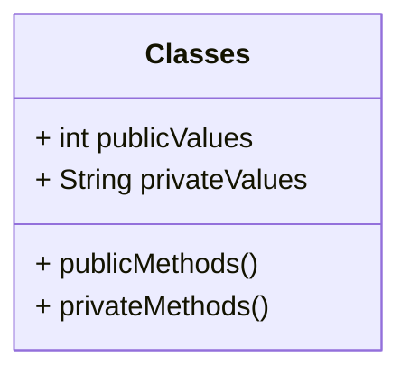

# Week 1

## Evolution of programming languages

### Assembly code

eg IBM Assembly

A simple example of addition and subtraction in assembly:
```
00 INP    ; Request input
01 STA 01 ; Store at first address 01
02 INP    ; Request second input
03 STA 02 ; Store at address 02
04 INP    ; Request third input
05 STA 03 ; Store at address 03
06 LDA 01 ; Load the value from address 01
07 ADD 02 ; Add the value from address 02
08 SUB 03 ; Subtract the value from address 03
09 OUT    ; Return the value in the accumulator
10 HLT    ; Halt the program
```

### Unstructured languages

Introduces human readable code.

eg BASIC

A simple example of user interaction in an imperative language:

```
10 INPUT "What is your name? "; USERNAME$
20 PRINT "Hello, " & USERNAME$
30 FOR I = 1 TO LEN(USERNAME$) + 7
40 LET UNDERLINE$ = UNDERLINE & "*"
50 NEXT I
60 PRINT UNDERLINE$
```

### Structured (Functional) languages

Introduces procedures (including a "Main" procedure)

eg QuickBASIC

A simple example of user interaction in an imperative language:

```
Public Module StarsProgram
   Private Function Ask(prompt As String) As String
      Console.Write(prompt)
      Return Console.ReadLine()
   End Function

   Public Sub Main()
      Dim userName = Ask("What is your name: ")
      Console.WriteLine("Hello {0}", userName)

      For I = 1 to Len(userName) + 7
         Console.Write("*")
      Next
   End Sub
End Module
```

### Object-oriented languages

Introduces objects, interfaces



